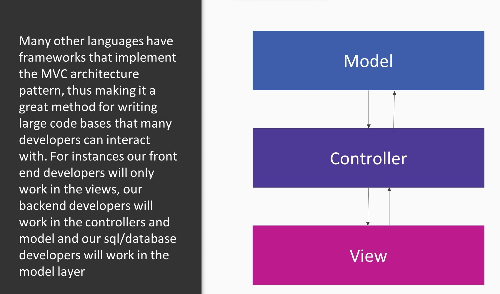
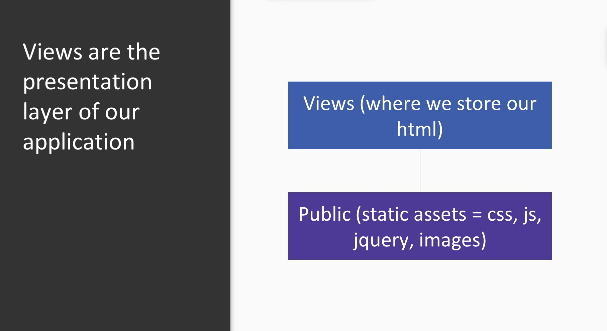

# Introducing ExpressJS

<details>
<summary>Table of Contents</summary>

## Table of Contents

- [Introducing ExpressJS](#introducing-expressjs)
- [Table of contents](#table-of-contents)
- [Module04 Overview](#module04-overview)
- [4.1 MVC Architecture](#41-mvc-architecture)
    - [Overview](#overview)
    - [Why organise our Application](#why-organise-our-application)
    - [What is MVC architecture?](#what-is-mvc-architecture)
- [4.2 Serve Static files and Set View Engine using ExpressJS](#42-serve-static-files-and-set-view-engine-using-expressjs)
    - [Serving static assets](#serve-static-assets---images-css-client-side-js-etc)
    - [Set View Engine](#set-view-engine)
- [4.3 Routing in ExpressJS](#43-routing-in-expressjs)
    - [Routing Basics](#routing-basics)
    - [Implement Get method](#implement-get-route-and-hello-world-in-browser)
    - [`POST`, `PUT`, `DELETE` routes ](#brief-about-postput-and-delete-routes)
  

</details>

## Module04 Overview

- Properly structuring our application in terms of long term maintainability using MVC architecture and ExpressJS
- Use ExpressJS to serve static files and setting our view engine.
- Routing and simple hello world using ExpressJS


## 4.1 MVC Architecture

### Overview
- Why learn using MVC
- How models, views and controllers interact with each other
- Structure our ExpressJS application

### Why organise our Application
    
- We organise our application using different architecture patterns makes our code easy to understand
- Using organised architecture pattern that is common makes code easy to understand and key to maintain application of all sizes.


### What is MVC architecture?

1. Model: Model is database where we store info such as - User accounts, scores, etc.
    <br> Generally database - MongoDB, MySQL, etc.
1. Controller: Controller sends data from model to view, and from view to model.
    <br>eg. HTML forms - Enter details, hit enter - _Sending data from view to model_
    <br>eg. Apply filters, search something, - _Getting data from model_
1. View: View is presentation layer. It simply outputs data given to it to user.

**Models and views cannot speak directly to each other and requires controller as bridge between them**


<p align="center">
</p>


## 4.2 Serve Static files and Set View Engine using ExpressJS

### Serve static assets - images, css, client-side js, etc
```JS
    const express = require('express');
    const app = express();

    app.use('/',express.static(__dirname + '/public'));

```


### Set View Engine

Install mustache-express via npm

```bash
    npm install mustache-express --save-dev
```

Setting view engine:

```JS
    const express = require('express');
    const app = express();

    const musthache = require('mustache-express');

    const portNumber = 3000;

    // const ejs = require('ejs');

    app.engine('html', ejs);
    app.set('view engine','html');
    app.set('views',__dirname + '/views');

    app.get('/',(req,res)=>{
        res.render('index');
    });

    app.listen(portNumber, (err)=>{
        (err) ? console.log("Error:",err) : console.log("Listening on localhost:", portNumber)
    });

    // Alternatives to view Engine are ejs, pug, etc.
```


<p align="center">
    
</p>


## 4.3 Routing in ExpressJS

### Routing Basics
- Routing is very important, when user enter specific route they expect to see certain content
- We use RESTful routing as a clear way of illustrating what our routes do
- Non RESTful routes : eg. www.website.com/?user=tommy
- RESTful routes : eg. www.website.com/users/tommy


### Implement get method and route, hello world in browser

```JS
const express = require('express');
const app = express();
const bodyParser = require('body-parser');
const mustache = require('mustache-express');

const portNumber = 3000;


app.use('/',express.static(__dirname + '/public'));
app.engine('html',mustache());
app.set('view engine','html');
app.set('views',__dirname + '/views');

app.use(bodyParser.urlencoded({extended:true}));
app.use(bodyParser.json());

// Implemented get method
app.get('/',(req,res)=>{
    res.render('index');
})

app.listen(portNumber,(err)=>{
    (err) ? console.log("Error:",err) : console.log("Listening on localhost:"+portNumber);
})

```


### Brief about post,put and delete routes

POST - 
We can use `POST` requests to create new resourses for instances when we submit user form or do gmail signup we update their database.

```JS
app.post('/users/new', function(request,response){
    // handle post
})
```

PUT - We can update an already created resource

```JS
    app.put('users/update/:id',function(request,response){
        // handle PUT
    })
```

DELETE - We can delete a resource 

```JS
app.delete('users/delete/:id',function(request,response){
    // handle DELETE
})

